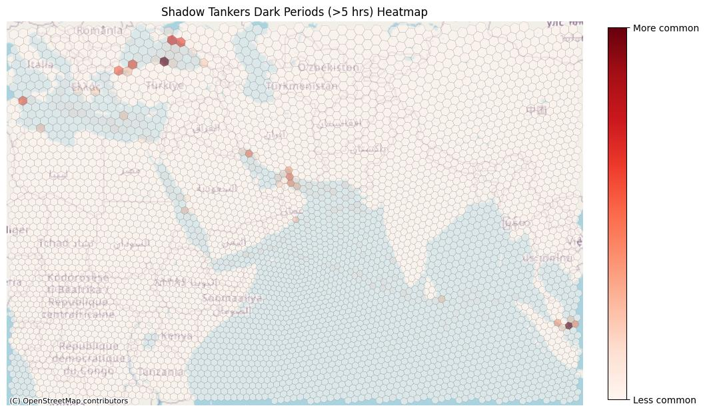

# Shadow Tanker Analysis Project

## Project Goal
The primary goal is to track known Russian shadow tankers and identify unknown ones. The analysis focuses on identifying vessels with suspicious behavior patterns, such as dark voyages and unusual routes, and detecting ship-to-ship (STS) transfers in AIS data where possible.

---

## Tasks

### Task 1: Identify "Dark" Voyages
#### 1a: Identify Dark Periods
**Approach**:  
Filtered AIS data to identify periods where shadow tankers had no AIS activity for more than 5 hours. Calculated the time spent "dark" (in hours) and the distance between the last ping before going dark and the first ping after reappearing. These events were merged to generate a heatmap using the H3 hex grid.

**Products**:
- `/products/1_darkvoyages/shadow_tanker_colocated_dark_periods.csv`
- `/products/1_darkvoyages/shadowtankers_dark_periods_heatmap.jpg` 

#### 1b: Identify Colocated Dark Periods
**Approach**:  
Identified periods where two or more vessels went dark within the same level 4 H3 cell (~1770 km² area) during overlapping time windows. This method is geographically specific but not highly sensitive, and the time window is sensitive but not specific.

**Products**:
- `/products/1_darkvoyages/shadow_tanker_colocated_dark_periods.csv`
- `/products/1_darkvoyages/shadowtankers_colocated_dark_periods_heatmap.jpg` 
- `/products/1_darkvoyages/shadowtankers_colocation_vignette.jpg` 

---

### Task 2: Identify Association Networks
#### 2a: Identify Vessels Associated with Shadow Tankers
**Approach**:  
Filtered AIS data to identify vessels that were in the same level 6 H3 hex (~36 km² area) during the same hour while both were moving. Repeated occurrences of such proximity were used to identify vessels potentially associated with shadow tankers.

**Products**:
- `/products/2_networkanalysis/newly_discovered_vessels.csv`
- The most highly associated vessel: [IMO 352002786](https://www.marinetraffic.com/en/ais/details/ships/shipid:3166/mmsi:352002786/imo:9302970/vessel:SAGAR1)

#### 2b: Create Network Diagram
**Approach**:  
Generated a network diagram showing association strength between shadow tankers and the 50 most associated newly discovered vessels. Edges represent normalized total occurrences of association.

**Products**:
- `/products/2_networkanalysis/shadowtankers_network.jpg` 

---

### Task 3: Detect Possible Ship-to-Ship Transfers
**Approach**:  
Filtered AIS data to identify possible ship-to-ship transfers (STS) among shadow tankers. STS events were defined as occurring when vessels were close together at low speeds. Used level 7 H3 hexes (~5 km² area) and a 1-hour time buffer to filter pings. This method is both specific and sensitive, detecting 5 possible STS events.

**Products**:
- `/products/3_shiptoship/possible_shadowtanker_shiptoship_events.csv`
- `/products/3_shiptoship/shadowtankers_shiptoship_vignette_1.jpg` 

---

### Task 4: Detect Anomalous Activity
**Approach**:  
Trained a k-means model in SQL (Google BigQuery) on the full dataset per level 6 H3 hex, using vessel heading and speed. Shadow tanker data was run through the model to identify potential outlier pings. Generated a global heatmap of anomalous activity and vignettes of the most anomalous behavior.

**Products**:
- `/products/4_anomalousactivity/anomalous_activity.csv`
- `/products/4_anomalousactivity/shadowtanker_anomalous_activity_heatmap.jpg` 
- `/products/4_anomalousactivity/anomalous_activity_vignette_mmsi_626378000.jpg`   
  *This vignette shows pings over a landmass, potentially indicating spoofing or low-quality pings.*
- `/products/4_anomalousactivity/anomalous_activity_vignette_mmsi_273216520.jpg`   
  *This vignette highlights anomalous behavior flagged by the algorithm, warranting further investigation.*

---

## Data
- **Known Shadow Tankers**: A predefined list of vessels under investigation.
- **AIS Data**: Covers January 1, 2024, to May 1, 2024, spanning the area from the Black Sea to the eastern Indian Ocean.
  - Note: MMSI is not a 1:1 match with IMO but is assumed as such for this analysis.
- **H3 Indexing**: Applied at multiple levels to the SQL dataset for efficient geospatial operations.

---

## Future Improvements
- Filter out narrow shipping lane areas to reduce false positives in STS detection.
- Expand STS detection to the full dataset for broader coverage.
- Refine anomaly detection models to improve sensitivity and specificity.
